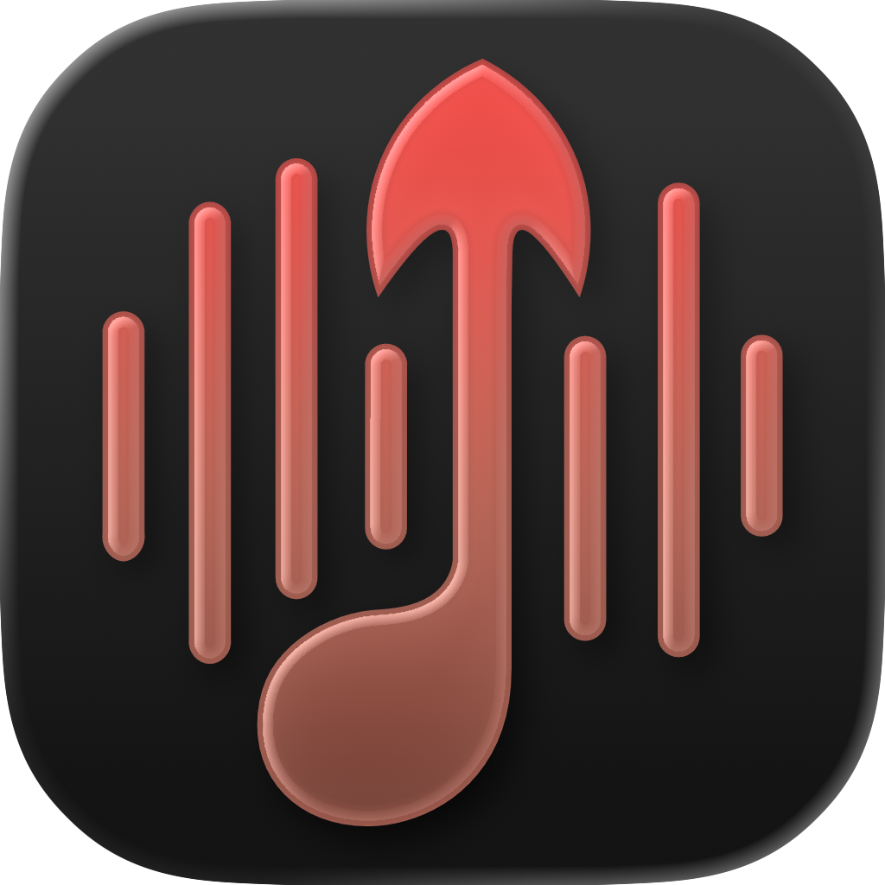
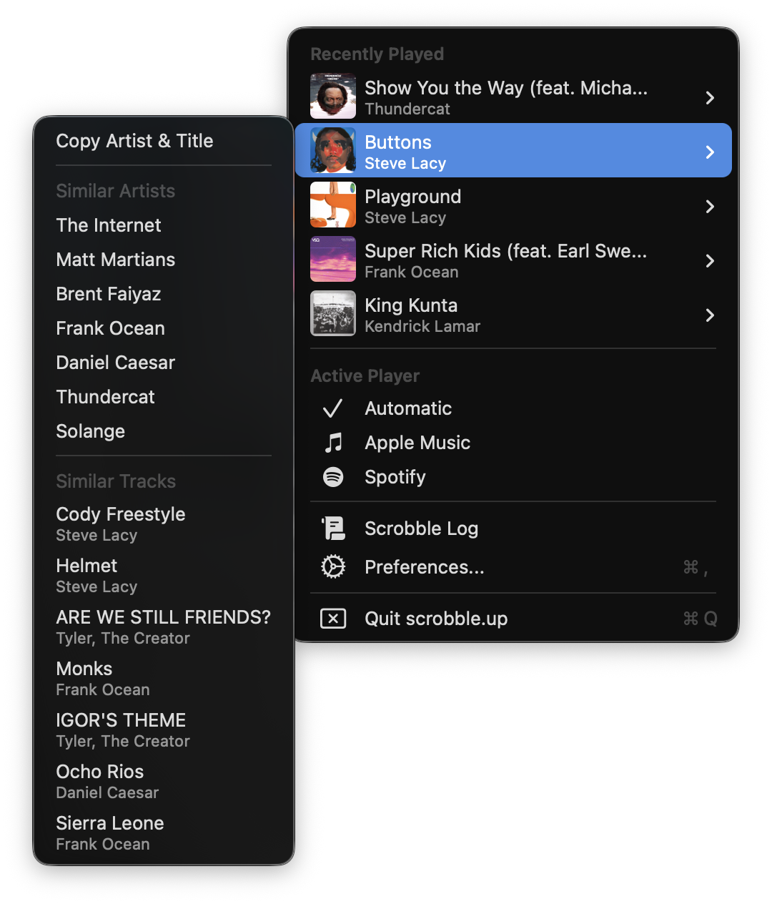

<h1 align="center">
   
    
   
    scrobble.up
    <h3 align="center"> 
      For the music 
    <h3 />
   
</h1>
      
**scrobble.up** is a lightweight free and open source scrobbler for macOS. 

### Features
- Lightweight (~80MB Memory Usage)
- Scrobble to Last.fm & ListenBrainz
- Track listens from a wide range of music players
- Similar artists and track suggestions from Last.fm
- Like syncing between Apple Music, ListenBrainz, and Last.fm
- Display track artwork in dock
- Desktop widget for displaying the current track
- Global shortcuts 
    - Bring Player to Front 
    - Love Track (Works for Last.fm, ListenBrainz, Spotify, and Apple Music)
- Free forever

### Screenshots

<h1 align="center">

<h1 />
  
## Installation
**System Requirements:**  
- macOS **14 Sonoma** or later  

---

### Manual Installation (Currently the only option)

---

## Building the app
### **Prerequisites**  
- **macOS 14 Sonoma** or later
- **Xcode 16** or later
- **last.fm API key & secret**
  - This can be obtained at: [Last.fm Create API Account](https://www.last.fm/api/account/create)
    - You'll need to provide a description of the application
      > A macOS menu bar application that scrobbles music via the system player to Last.fm.
### **Setup**
1. Clone the repository
2. Rename **Secrets.xcconfig.example** to **Secrets.xcconfig**
3. Add the API key & secret you created to **Secrets.xcconfig**

---

## Credits & Acknowledgments

- ### [**NowPlaying**](https://github.com/diego-castilho/NowPlaying) - The project that scrobble.up is based on.
- ### [**boring.notch**](https://github.com/TheBoredTeam/boring.notch) - Much of the functionality for the like syncing feature comes from boring.notch. The README for scrobble.up is also based on boring.notch's.
- ### [**LastFM.swift**](https://github.com/duhnnie/LastFM.swift) - Amazing library used for communicating with last.fm.
